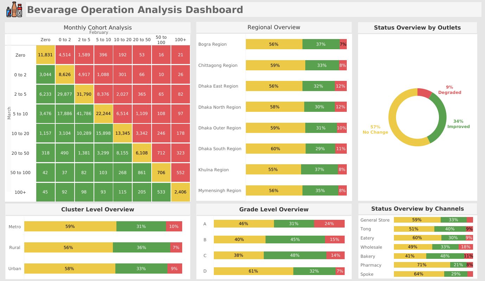

# Beverage Company Outlet Operations Analysis Dashboard

This project presents a data analysis dashboard for a beverage company, focusing on the operational performance of its sales outlets. The dashboard provides a comprehensive overview of sales trends and outlet performance using key metrics and visualizations, allowing stakeholders to quickly identify areas of improvement and monitor operational health.

### ****
## Dashboard Features

The dashboard is divided into several key sections to provide a holistic view of the data.

### 1. Cohort Analysis (Top Left)

A monthly **cohort analysis** provides a deep dive into outlet performance by comparing sales from the current month against the previous month. This visualization is displayed as a **heatmap-style matrix**.

- **Slabs**: Sales are categorized into specific ranges: `0`, `0–2`, `2–5`, `5–10`, `10–20`, `20–50`, `50–100`, and `100+`.
- **Matrix Cells**: Each cell in the matrix represents the number of outlets that fall into a specific sales slab for both the previous and current months. For example, the cell `(0,0)` shows the count of outlets with zero sales in both months.
- **Performance Interpretation**:
    - **Green** 🟢: Indicates **Improved** performance, where current month sales are greater than the previous month.
    - **Red** 🔴: Indicates **Degraded** performance, where current month sales are less than the previous month.
    - **Yellow** 🟡: Indicates **No Change**, where sales remained the same.

### 2. Regional and Overall Status (Top Section)

- **Regional Overview (Top Middle)**: A stacked bar chart showing the percentage of outlets that have improved, degraded, or had no change in sales, broken down by region.
- **Overall Status (Top Right)**: A donut chart that provides a quick, high-level summary of the overall percentage of outlets that have improved, degraded, or remained unchanged.
    - **Interactivity**: Clicking on a segment of the donut chart reveals links to individual outlets in a tooltip. Clicking an outlet link dynamically updates the dashboard to show detailed information for that specific outlet.

### 3. Performance Overviews (Bottom Section)

This section features three stacked bar charts, each providing a different perspective on outlet performance (improved, degraded, no change).

- **Cluster Level Overview**: Performance analysis at the cluster level.
- **Grade Level Overview**: Performance analysis segmented by outlet grade.
- **Status by Channel**: Performance analysis by sales channel.

---

### Business Impact

This dashboard empowers a beverage company's sales and management teams to make data-driven decisions. By quickly identifying underperforming regions, clusters, grades, or channels, the company can deploy targeted interventions. For example, a high percentage of degraded outlets in a specific cluster could prompt a review of local market conditions or a change in sales strategy. The cohort analysis also enables the tracking of outlet health over time, highlighting both successes to replicate and persistent challenges to address, ultimately driving sales growth and optimizing operational efficiency.

---

## Technologies Used

- **Dashboard Tool**: Tableau
- **Languages**: SQL

