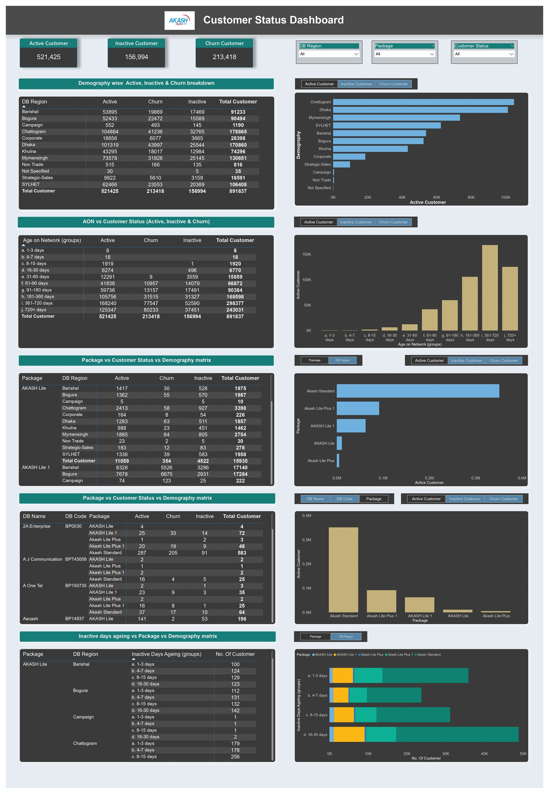

# Akash Digital TV – Customer Churn Analysis (Power BI)

## 📌 Project Summary
This project analyzed **customer churn data** for **Akash Digital TV**, a dish TV service provider.  
Key metrics such as **active customers, inactive customers, churn rate, and customer demographics** were examined to identify factors influencing customer retention and highlight areas for improvement.

---

## 📖 Project Description
A comprehensive analysis of Akash Digital TV’s customer data was conducted using **Power BI** to gain insights into **customer churn patterns and retention strategies**.  
The analysis focused on **active/inactive customers, churn rates, and demographics**, uncovering trends and patterns that impact customer retention.
---
### 🔹 Dashboard Pages:

****

---

## 🔹 Key Findings

### 1. Customer Churn Analysis
- Identified key churn drivers such as **subscription package, region, and customer demographics**.  
- Analyzed churn rates by **age on network, package type, and region**.  
- Assessed the effect of **inactive days aging** on churn likelihood.  

### 2. Customer Segmentation
- Segmented customers based on **demographics and subscription packages**.  
- Identified **high-risk segments** and developed **targeted retention strategies**.  

### 3. Performance Analysis
- Evaluated **subscription package performance** across regions.  
- Analyzed **distributor performance**, highlighting both **top-performing** and **underperforming** distributors.  

---

## 🔹 Dashboard Components

**Card Visuals**
- Total active customers  
- Total inactive customers  
- Total churn customers  

**Slicers**
- Region  
- Subscription package  
- Customer status  
- Demography  

**Tables**
- Breakdown of **active, inactive, and churn customers** by region & demographics  

**Charts**
- Bar charts  
- Column charts  
- Stacked bar charts  
- Matrices  

---

## 🔹 Business Impact

The insights derived from this analysis enabled **Akash Digital TV** to:

- **Improve Customer Retention**: Develop **targeted strategies** for at-risk customers.  
- **Optimize Subscription Packages**: Identify and refine underperforming packages.  
- **Enhance Customer Experience**: Improve customer service and product offerings.  
- **Improve Distributor Performance**: Provide training and support to low-performing distributors.  

---

