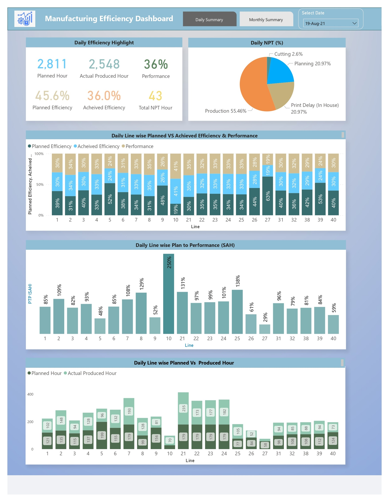
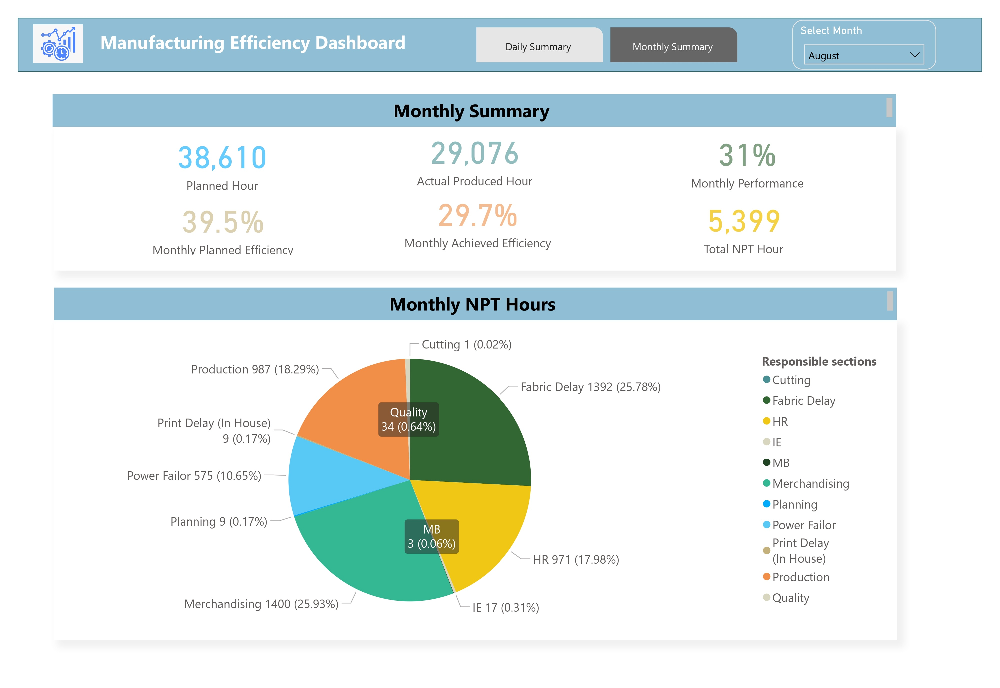

# Factory – Manufacturing Efficiency Analysis (Power BI)

## 📌 Project Summary
In this project I have analyzed **manufacturing efficiency data** for an **RMG (Ready-Made Garments) factory** to gain insights into production performance, identify bottlenecks, and optimize operational efficiency.  
Key metrics such as **planned hours, actual produced hours, efficiency, and Non-Productive Time (NPT)** were examined to highlight opportunities for improvement.

---

## 📖 Project Description

### 🔹 Overview
A comprehensive analysis of RMG factory production data was conducted using **Power BI** to evaluate **manufacturing efficiency** and identify areas for optimization.  
The analysis focused on **planned vs. actual hours, efficiency, and NPT** to improve overall productivity.

---
### 🔹 Dashboard Pages:

****

****

---

## 🔹 Key Findings

### 1. Daily Performance
- Compared **planned hours vs. actual produced hours** to track daily performance.  
- Identified **bottlenecks** and areas with **low efficiency**.  
- Measured the **impact of NPT** on daily productivity.  

### 2. Monthly Performance
- Assessed **monthly production performance**, identifying key trends and variations.  
- Evaluated the **effect of NPT** on monthly efficiency.  

### 3. Departmental Performance
- Compared performance across **departments** to identify strengths and weaknesses.  
- Highlighted opportunities for **cross-functional collaboration** and process improvement.  

---

## 🔹 Dashboard Components

**Filters**
- Date  

**Daily Summary**
- Planned hours  
- Actual produced hours  
- Performance  
- Planned efficiency vs. Achieved efficiency  
- Total NPT hours  
- Daily NPT percentage (Pie Chart)  
- Line-wise planned vs. achieved efficiency and performance charts  

**Monthly Summary**
- Planned hours  
- Actual produced hours  
- Monthly performance  
- Planned efficiency vs. Achieved efficiency  
- Total NPT hours  
- Monthly NPT percentage (Pie Chart)  

---

## 🔹 Business Impact

The insights derived from this analysis enabled the RMG factory to:

- **Identify Bottlenecks**: Detect areas of low efficiency and address root causes.  
- **Optimize Production Planning**: Minimize idle time and maximize productivity.  
- **Reduce Non-Productive Time (NPT)**: Implement strategies to reduce downtime.  
- **Enhance Departmental Collaboration**: Improve coordination and communication between departments.  

---

