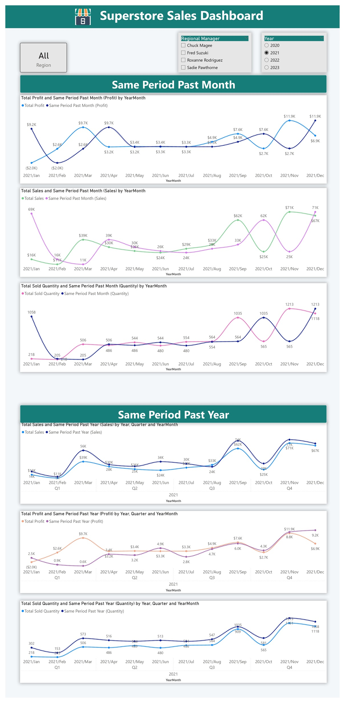

# Superstore Sales Analysis – Power BI

## 📌 Project Summary
This project analyzed sales data for a superstore to gain insights into **sales performance, profitability, customer behavior, and regional trends**.  
Key metrics such as **sales, profit, orders, returns, and customer demographics** were explored to identify opportunities for improvement and optimize business operations.

---

## 📖 Project Description

### 🔹 Overview
A comprehensive analysis of superstore sales data was conducted using **Power BI** to gain a holistic understanding of sales performance and identify areas for improvement.  
Metrics analyzed include **sales, profit, orders, returns, customer demographics, and regional trends**, with the goal of uncovering optimization opportunities.

---
### 🔹 Dashboard Pages:

****

****

****

---

### 🔹 Key Findings

#### 1. Sales Performance
- Analyzed overall sales trends, identifying peak sales periods and seasonal fluctuations.  
- Evaluated performance by **product categories, regions, and customer segments**.  
- Identified **top-selling products and high-performing regions**.

#### 2. Profitability Analysis
- Assessed profitability by **product, region, and customer segment**.  
- Highlighted areas for improvement in **pricing strategies and cost management**.  
- Analyzed the **impact of discounts** on both sales and profitability.  

#### 3. Customer Behavior
- Explored **customer demographics, purchasing patterns, and return rates**.  
- Identified **high-value customers** and potential **churn risks**.  
- Evaluated the effectiveness of **shipping modes and delivery times**.  

#### 4. Regional Trends
- Compared sales performance across different regions to identify **variations and opportunities**.  
- Analyzed external factors such as **economic conditions and customer preferences** influencing sales.  

---

### 🔹 Dashboard Components

**Filters**
- Regional manager  
- Date  

**Sales Highlights**
- Total sales  
- Total sold quantity  
- Total customers  
- Return sales & quantity  
- Average sales per customer  

**Order & Profit Highlights**
- Total orders  
- Average days to ship  
- Total return orders & return percentage  
- Total profit & discount  
- Average profit per customer  
- Profit percentage  

**Charts**
- Bar charts  
- Bubble maps  
- Area charts  
- Stacked column & bar charts  
- Pie charts  

**Top N & MTD**
- Top N products/customers by **sales, profit, orders, and quantity**  
- Month-to-date (MTD) & Year-to-date (YTD) performance  

**Same Period Analysis**
- Year-over-year (YoY) comparisons of **sales, profit, and quantity**  

---

### 🔹 Business Impact

The insights derived from this analysis enabled the superstore to:

- **Optimize Product Mix**: Identify high-performing and underperforming products to improve **inventory & marketing strategies**.  
- **Improve Pricing Strategies**: Adjust pricing to **maximize profitability** while maintaining customer satisfaction.  
- **Enhance Customer Experience**: Improve shipping, delivery times, and overall service quality.  
- **Optimize Regional Operations**: Tailor **marketing & sales strategies** based on regional preferences and economic conditions.  

---

