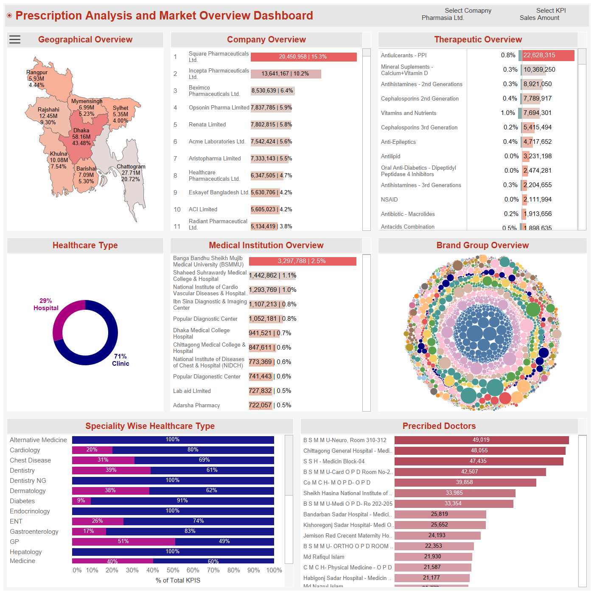
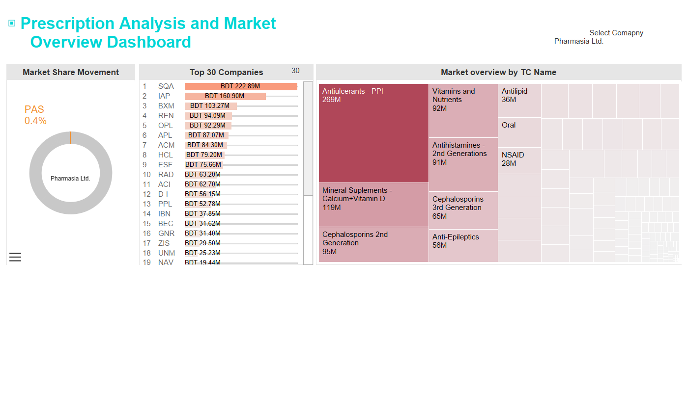
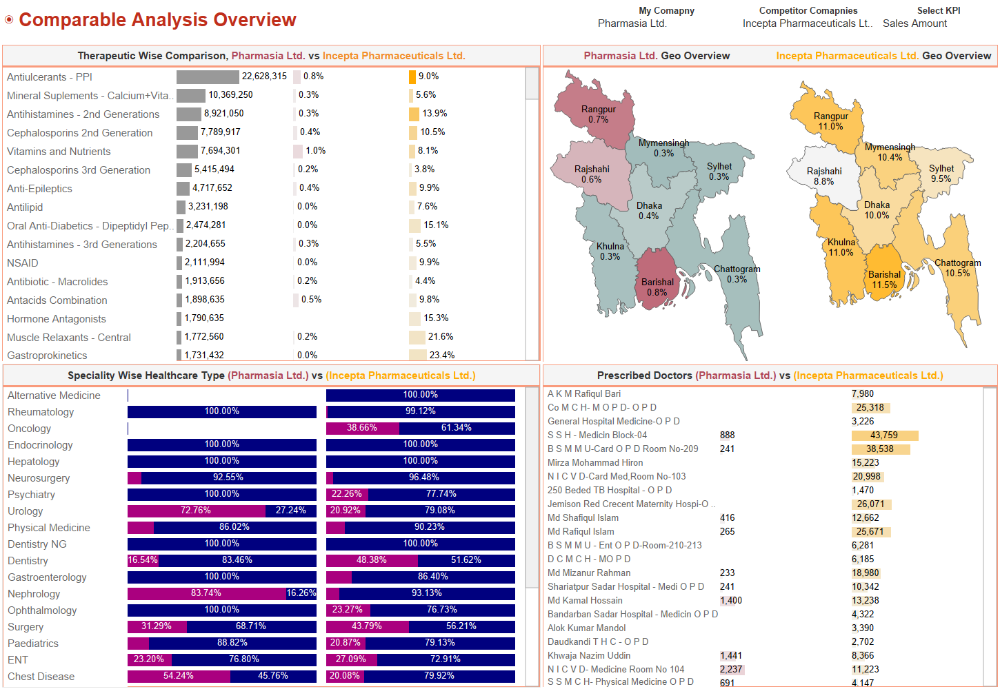
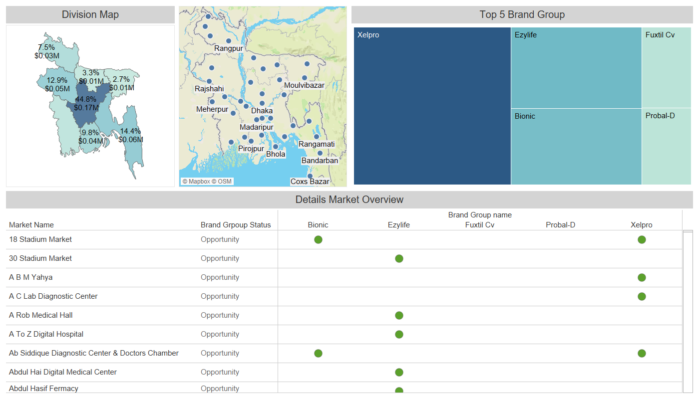

# Pharmaceutical Sales Analysis Dashboard 
## Project Overview

This project presents a comprehensive, interactive dashboard developed to analyze prescription trends and market dynamics within the pharmaceutical sector of Bangladesh. The solution provides key stakeholders with actionable insights, enabling them to monitor market share, evaluate brand performance, understand prescriber behavior, benchmark competitors, and identify untapped market opportunities. The project leverages a multi-page Power BI report to deliver a unified and insightful data experience.

### ****

---

## Key Features

The dashboard is structured into four main sections to provide a complete view of the market landscape.

### **1. Market Status Page**

This section offers a high-level, strategic overview of market performance.

* **Company Market Share Donut Chart:** Visualizes a selected company’s market share as a percentage of total sales amount.
* **Top N Companies Bar Chart:** A dynamic chart that allows users to rank and view the top `N` companies based on sales, controlled via a parameter.
* **Therapeutic Class Tree Map:** Displays sales amount across different therapeutic classes. This visual is interactive, with a drill-down feature that updates the company rankings to show performance within a specific therapeutic class.

### ****

---

### **2. Prescription Analysis Page**

This section provides a detailed, granular view of prescription data, enabling drill-down exploration from regional levels down to individual doctors and prescriptions.

* **Region-wise Market Map:** A geographic map highlighting market share and sales amount across different divisions of Bangladesh.
* **Company Overview Bar Chart:** Ranks companies by their total sales and market share.
* **Therapeutic Class Dual-Axis Chart:** Compares market share percentage and sales amount for different therapeutic classes on a single chart.
* **Healthcare Type Donut Chart:** Illustrates the distribution of sales between hospitals and clinics.
* **Medical Institution Overview:** A bar chart showing the percentage of sales contributed by different medical institutions.
* **Brand Group Bubble Chart:** A bubble chart visualizing brand-wise market share and sales amount.
* **Specialty-wise Healthcare Breakdown:** Analyzes sales data across different medical specialties within hospitals and clinics.
* **Prescribed Doctors Bar Chart:** Displays prescription quantity by individual doctors. This visual is highly interactive, allowing for a guided drill-down from division → company → brand → institution → doctor. Filters are designed to cascade across all visuals, enabling users to trace prescription patterns down to the doctor level.

### ****

---

### **3. Comparative Analysis Page**

This section is dedicated to competitive intelligence, supporting a side-by-side benchmarking analysis between two selected companies.

* **Therapeutic Class Comparison (Bar Chart):** Compares the sales amount and percentage for each therapeutic class for both selected companies.
* **Division-Level Market Map (Dual View):** A dual-map visualization that shows the geographic performance (sales and market share) of both companies by division.
* **Specialty-wise Healthcare Type Comparison:** Compares hospital vs. clinic sales percentages by specialty type for each company.
* **Doctor Prescription Comparison:** Provides a side-by-side view of doctor-level prescription volumes for both companies, facilitating direct comparison of prescriber behavior.

### ****

---

### **4. Opportunity Analysis Page**

This section is designed to identify brand placement gaps and evaluate market expansion potential.

* **Division Map:** Displays total sales by division.
* **Sub-Division Map (Drill-Down):** An interactive map where clicking on a division reveals all the sub-areas within it.
* **Top 5 Brands Tree Map:**
  * Shows the overall top brands when no division is selected.
  * Dynamically filters to display the top brands within a selected division.
* **Opportunity Table:**
  * Lists each market with a clear "Opportunity" or "No Opportunity" tag.
  * Markets that are missing one or more of the top 5 brands are flagged with a green gap indicator.
  * Details of the specific brand gaps are displayed in columns on the right.

### ****

---

## Business Value Delivered

* **Granular Insight:** Enabled granular prescription tracking from the national level down to the individual doctor level.
* **Competitive Edge:** Facilitated competitive benchmarking by product, geography, and specialty to identify strengths and weaknesses.
* **Market Expansion:** Identified white-space markets and brand placement opportunities for strategic growth.
* **Strategic Support:** Provided essential data to support strategic planning and targeted marketing efforts for medical representatives and marketing teams.

---

## Technologies Used

* **Data Analysis & Visualization:** Tableau, SQL, Excel

