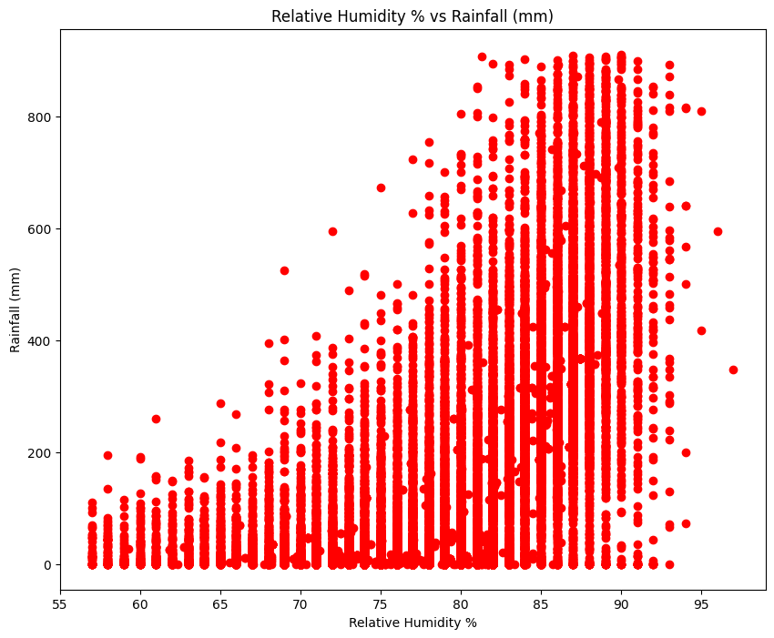
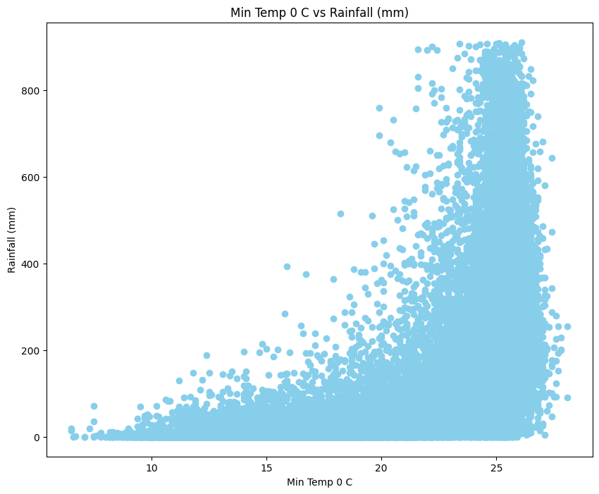
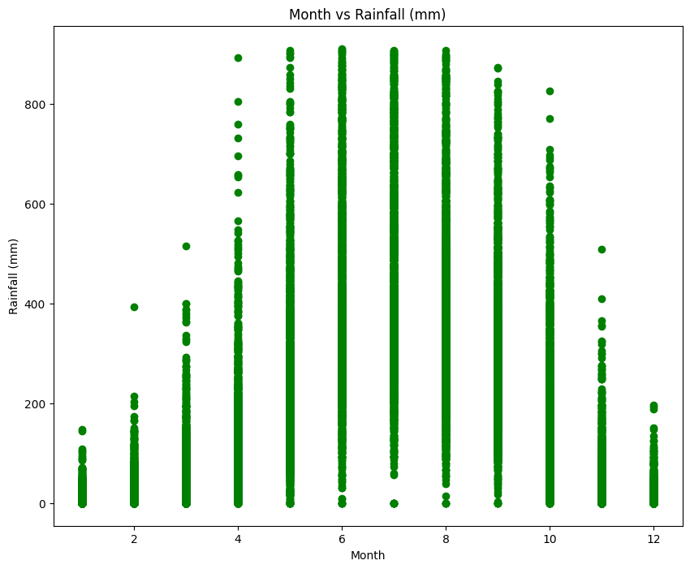
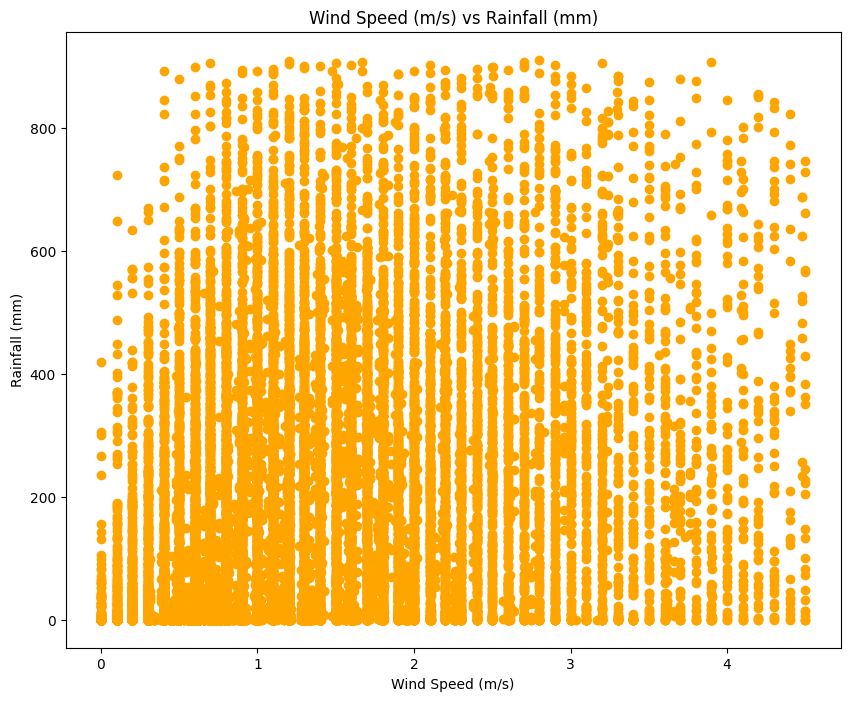
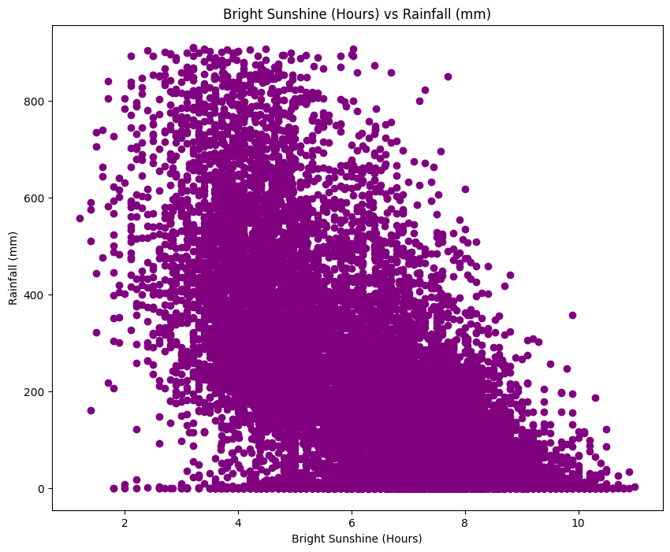
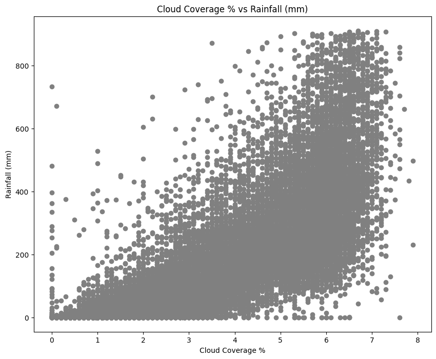

# Rainfall Prediction in Bangladesh Using Machine Learning

## Project Overview

This project aimed to develop accurate rainfall prediction models for Bangladesh using historical weather data. By leveraging machine learning techniques, the project sought to assist in agricultural planning, disaster management, and resource allocation.

---
### 🔹 Project Images:

****
****
****
****
****
****
****

---

## Key Achievements
- **Comprehensive Model Evaluation:** Implemented and compared nine supervised machine learning models: Multiple Linear Regression, Polynomial Regression, Decision Tree, K-Nearest Neighbors, Support Vector Machine, Random Forest, AdaBoost Regressor, Stacking Regressor, and Artificial Neural Network.  
- **Accurate Rainfall Prediction:** The best-performing model, **Polynomial Regression**, achieved an R-squared value of **0.7644** and an RMSE of **99.12** on the test set.  
- **Feature Importance:** Identified key weather features influencing rainfall prediction, including temperature, humidity, wind speed, cloud coverage, and bright sunshine hours.  

---

## Methodology

### Data Collection and Preprocessing

Collected 65 years of weather data (1948–2013) from Kaggle. Data was preprocessed by removing outliers and normalizing features.

### Model Development

Implemented multiple machine learning models and tuned hyperparameters to achieve optimal performance.

### Evaluation

Data was split into training (80%) and testing (20%) sets. Models were evaluated using R-squared and RMSE metrics.

---

## Results

| Model Name                 | RMSE (Train) | R² (Train) | RMSE (Test) | R² (Test) |
|---------------------------|--------------|------------|-------------|-----------|
| Multiple Linear Regression | 118.32       | 0.6643     | 118.28      | 0.6687    |
| Polynomial Regression      | 99.84        | 0.7639     | 99.12       | 0.7644    |
| Decision Tree              | 101.20       | 0.7545     | 107.14      | 0.7282    |
| K-Nearest Neighbors        | 5.58         | 0.9993     | 103.32      | 0.7472    |
| Support Vector Machine     | 120.11       | 0.6541     | 120.12      | 0.6583    |
| Random Forest              | 38.68        | 0.9641     | 99.63       | 0.7650    |
| AdaBoost Regressor         | 110.97       | 0.7048     | 110.49      | 0.7109    |
| Stacking Regressor         | 102.90       | 0.7461     | 106.15      | 0.7332    |
| Artificial Neural Network  | 100.91       | 0.7559     | 100.77      | 0.7596    |

---

## Conclusion

This project demonstrates the potential of machine learning for accurate rainfall prediction in Bangladesh. The Polynomial Regression model outperformed others, highlighting the importance of non-linear relationships in capturing rainfall patterns. Future research can explore advanced techniques and larger datasets to further improve prediction accuracy.

---

## Notebook Access
🔗 [Google Colab Notebook](https://colab.research.google.com/drive/1GMw2AFhALPT_xZA8flXm-0dSD0uExhuY?authuser=1#scrollTo=8_FyW7E-4mpg)

