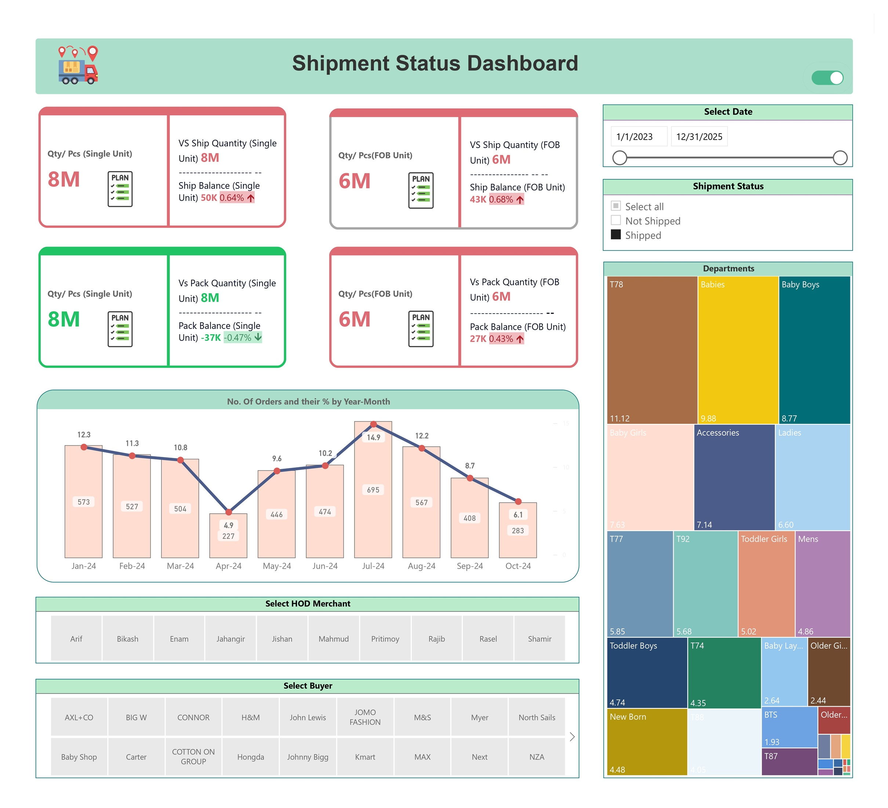

# Shipment Status Dashboard – Manufacturing Factories (Power BI)

## 📌 Project Summary

In this project I developed a <b>Shipment Status Dashboard</b> for manufacturing factories to monitor <b>shipment and packing performance</b> against planned quantities.  
The dashboard provides <b>real-time visibility</b> into shipment balance, packaging status, and order performance, enabling better coordination between departments and buyers.

---

## 📖 Project Description

The dashboard was built in **Power BI** to analyze shipment status at both **Single Unit** and **FOB (Free on Board) Unit** levels.  
It includes **interactive KPIs, trend analysis, and filtering options** to track shipment progress and identify pending quantities.

---
### 🔹 Dashboard:

****

---

## 🔹 Dashboard Components

### 1. KPI Card Visuals (Top Section)

- **Card 1:**  
  - **Qty/Pcs (Single Unit)** vs **Shipment Quantity (Single Unit)**  
  - Displays **Shipment Balance Qty** (number & %) with arrow indicators.  
  - **Conditional Formatting:**  
    - If shipment < Qty/Pcs → **Red** border, digits & downward arrow.  
    - If shipment ≥ Qty/Pcs → **Green** border, digits & upward arrow.  

- **Card 2:**  
  - **Qty/Pcs (FOB Unit)** vs **Shipment Quantity (FOB Unit)**  
  - Shows **Shipment Balance (FOB Unit)** (number & %) with arrow indicators.  
  - **Conditional Formatting:**  
    - If shipment < Qty/Pcs → **Red** border, digits & downward arrow.  
    - If shipment ≥ Qty/Pcs → **Green** border, digits & upward arrow.  

- **Card 3:**  
  - **Qty/Pcs (Single Unit)** vs **Pack Quantity (Single Unit)**  
  - Displays **Pack Balance (Single Unit)** (number & %) with arrow indicators.  
  - **Conditional Formatting:**  
    - If pack < Qty/Pcs → **Red** border, digits & downward arrow.  
    - If pack ≥ Qty/Pcs → **Green** border, digits & upward arrow.  

- **Card 4:**  
  - **Qty/Pcs (FOB Unit)** vs **Pack Quantity (FOB Unit)**  
  - Shows **Pack Balance (FOB Unit)** (number & %) with arrow indicators.  
  - **Conditional Formatting:**  
    - If pack < Qty/Pcs → **Red** border, digits & downward arrow.  
    - If pack ≥ Qty/Pcs → **Green** border, digits & upward arrow.  

---

### 2. Trend Analysis
- **Line & Stacked Column Chart**  
  - **Column:** Number of orders per month.  
  - **Line:** % of orders per month.  

---

### 3. Filters & Slicers
- **Shipment Status Filter:** Shipped vs. Not Shipped products.  
- **Date Filter:** Predefined options → *Current Year, Last Month, Last Year, MTD*.  
  - **Custom Mode:** Toggle switch enables a **custom date range filter**.  
- **Button Slicers:**  
  - Select by **HOD Merchant**.  
  - Select by **Buyer**.  

---

### 4. Department Analysis
- **Tree Map Visual**  
  - Displays **department-wise order %**.  
  - Can be used as a **filter** to drill into specific departments.  

---

## 🔹 Business Impact
The dashboard enabled manufacturing factories to:
- **Track Shipment Performance:** Monitor shipment and packing progress in real time.  
- **Improve Order Management:** Quickly identify pending orders and shipment delays.  
- **Enhance Collaboration:** Provide visibility across **departments, merchants, and buyers**.  
- **Data-Driven Decisions:** Optimize shipment planning with clear balance and trend insights.  

---

