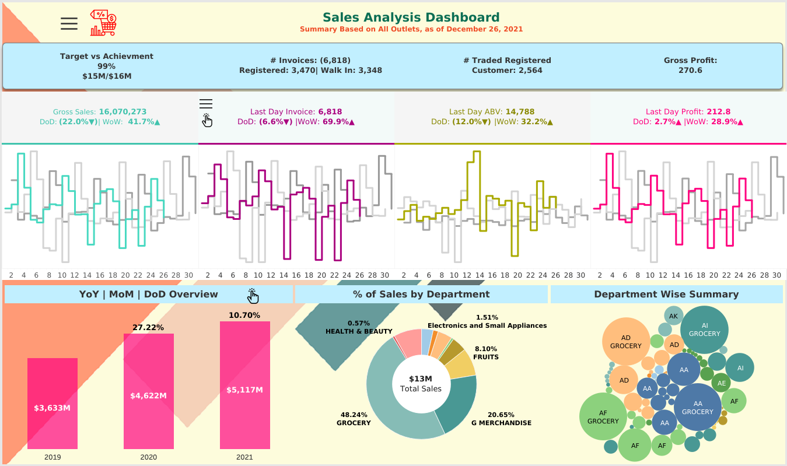
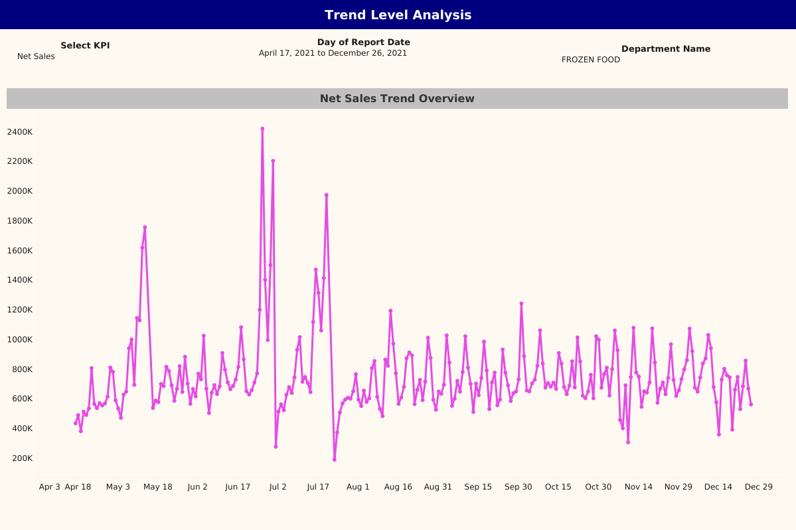

# SuperShop Sales Analysis Dashboard

## 📊 Project Overview

This project is a comprehensive **SuperShop Sales Analysis Dashboard** designed to provide in-depth insights into the sales performance and trends of a supermarket chain. It's built to empower store managers and business analysts to monitor key performance indicators (KPIs), track trends, and make data-driven decisions.

The dashboard is structured into two main sections: a **Summary Page** for a high-level overview and a **Trend Analysis Page** for deep-dive exploration.

---

## 🚀 Key Features

### Summary Page
### ****
The Summary Page gives a quick, at-a-glance view of the SuperShop's overall performance.

* **Filters**: A toggle filter allows users to select different outlet names. An indicator shows whether the sales target has been met for the selected outlet.
* **KPI Cards**: At the top, cards display key metrics:
    * **Net Sales**: Shows target vs. achievement with percentage and dollar values.
    * **Invoices**: Tracks total invoices, registered customers, and working customers.
    * **Gross Profit**: Highlights profit performance.
* **Performance Cards**: A series of cards display critical KPIs with **Day-on-Day (DoD)** and **Week-on-Week (WoW)** comparisons to show recent performance shifts.
    * `Gross Sales`
    * `Last Day Invoice`
    * `Last Day ABV (Average Basket Value)`
    * `Last Day Profit`
* **Trend Comparisons**: Each performance card is accompanied by a trend chart comparing the current month to the previous month, using a distinct smoothened step-like trend line.
* **Sales Breakdown**: This section provides a multi-dimensional view of sales data:
    * **Drill-down bar chart**: Interactively explore Net Sales by year, month, and day.
    * **Donut chart**: Illustrates the **Percent of Sales by Department**.
    * **Bubble chart**: Displays **Net Sales by outlet**, where bubble size indicates sales magnitude.

### Trend Analysis Page
### ****
This dedicated page is for a deep-dive exploration of sales data.

* **Customizable Filters**: Users can select a specific **KPI (Net Sales, Gross Sales, Gross Profit, Invoices)**, a **date range**, and a **department**.
* **Trend Chart Generation**: The page generates a detailed monthly trend chart based on the user's selections, allowing for granular analysis of performance across different departments and over specific time periods.

---

## 📈 Business Impact

This dashboard provides a comprehensive view of performance, drill-down interactivity, and KPI-based trend analysis to support sales monitoring and decision-making. By visualizing complex data in an intuitive way, the SuperShop Sales Analysis Dashboard enables stakeholders to quickly identify top-performing outlets, recognize underperforming product categories, and understand seasonal sales patterns. This empowers management to optimize inventory, refine marketing strategies, and ultimately drive revenue growth.

