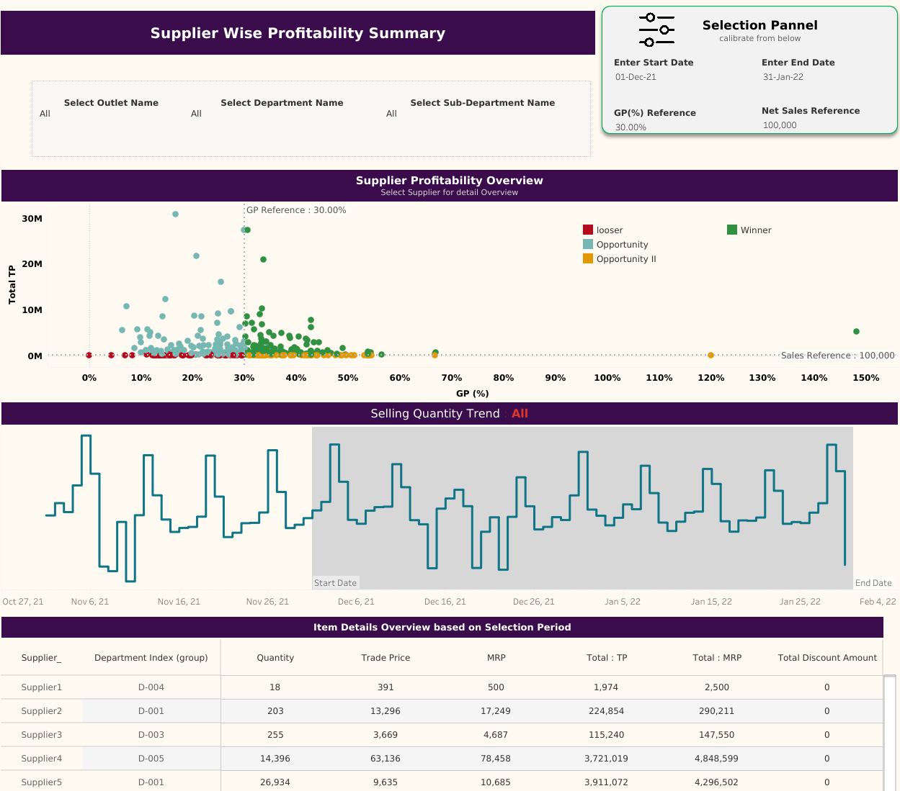
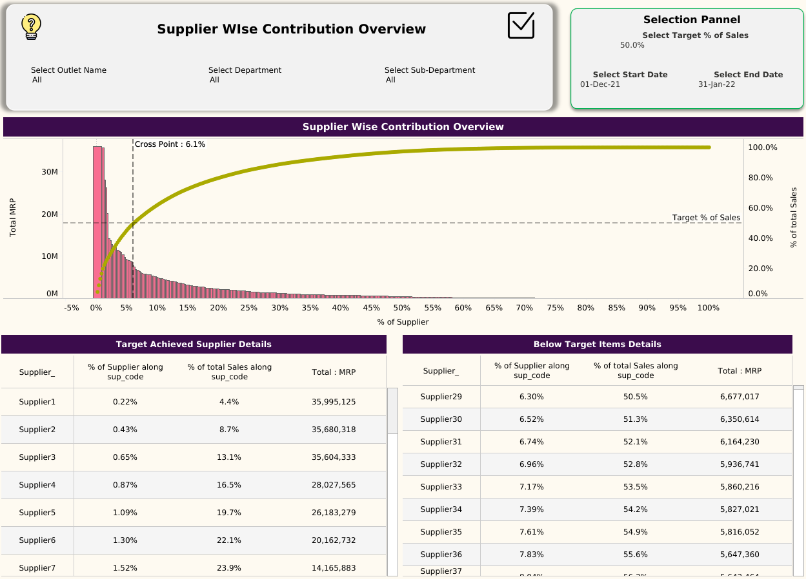

# Supplier Profitability and Contribution Dashboard

## 📌 Project Summary
Developed a **Supplier Profitability and Contribution Dashboard** for **SuperShop**, designed to provide decision-makers with clear insights into supplier performance, sales contribution, and profitability. The dashboard leverages interactive filters, scenario analysis, and visualizations to identify key suppliers, monitor trends, and drive data-backed business strategies.

---

## 📊 Project Description

This project focused on building a **two-page analytical dashboard** to enhance supplier-level decision-making:

### Page 1: Supplier Wise Profitability Summary
- Interactive filters for **outlet, department, and sub-department** selection.  
- **Parameter-driven selection panel** for start date, end date, cost-profit percentage, and net sales reference.  
- **Cluster plot** mapping total trade price (TP) against gross profit (GP%) to segment customers into categories: *winners, losers, and opportunities*.  
- **Selling quality trend chart** displaying product quantity and transaction timelines.  
- **Item details overview table** with supplier information, pricing, discounts, and totals.  

### ****

### Page 2: Supplier Wise Contribution Overview
- Dynamic filters and parameters including **target percentage of sales** and **time range**.  
- **Pareto analysis chart** illustrating the 80/20 principle, highlighting suppliers contributing the most to sales revenue (MRP).  
- **Target supplier details table** showing supplier code, contribution percentage, and sales values.  
- **Below-target item details table** to identify underperforming suppliers.  

### ****
---

## 🚀 Business Impact
The dashboard enabled **SuperShop’s management** to:
- Quickly identify **high-value suppliers** and track underperforming ones.  
- Optimize **purchasing and promotional strategies**.  
- Visualize **profitability drivers** and **sales concentration**.  
- Prioritize **top contributors**, negotiate better supplier terms, and reduce losses from low-margin partners.  

✅ Overall, the solution improved **transparency in supplier performance**, supported **data-driven negotiations**, and strengthened the company’s ability to align supply strategies with revenue goals.
